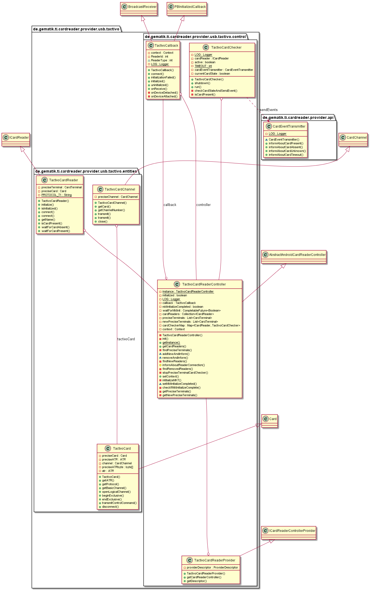

# USB-Tactivo-CardReaderProvider

# Introduction

This part describes the usage of low level CardReaderProvider for USB Tactivo CardReader in your application.

# API Documentation

Generated API docs are available at <https://gematik.github.io/ref-CardReaderProvider-USB-Tactivo-Android>.

# License

Licensed under the [Apache License, Version 2.0](https://www.apache.org/licenses/LICENSE-2.0).

The USB Tactivo CardReader provider uses the Precise Mobile Toolkit for Android SDK developed by Precise Biometrics.
This framework is provided by Precise Biometrics for use exclusively with Tactivo Card Reader, and is governed by the terms of use granted by license to
users of the Tactivo Card Reader.

# Overview

  

## Integration

The Tactivo USB CardReaderProvider needs a descriptor behind `YOUR.PROVIDER\src\main\resources\META-INF\services` with filename
`de.gematik.ti.cardreader.provider.spi.ICardReaderControllerProvider` and the content of the package and class which implements the service provider interface
`de.gematik.ti.cardreader.provider.usb.tactivo.control.TactivoCardReaderProvider`.

# Hardware

The integrated Precise Mobile Toolkit for Android SDK supports the integrating of smart card and fingerprint functionality using Tactivo mini.

# Additional Software

To initialize a Tactivo cardReader, it is necessary to install the Tactivo Manager App on the device. (<https://play.google.com/store/apps/details?id=com.precisebiometrics.android.mtk.manager&hl=gsw>)

# Control

## TactivoCardReaderProvider

The TactivoCardReaderProvider class needs implementation of the interface 'ICardReaderControllerProvider' to handle listener and provide methods to inform connected listeners about card reader changes.

  

## TactivoCardReaderController

The TactivoCardReaderController extends the abstract class 'AbstractCardReaderController' to handle necessary permissions and checking if the application context is set. Returns a list with currently connected Tactivo cardReaders and informs about reader connection and disconnection.
Additionally start and stop the controller for each TactivoCardReader the associated [TactivoCardChecker](#_tactivocardchecker).

  

## TactivoCallback

The TactivoCallback class implements the PBInitializedCallback class from Precise Mobile Toolkit for Android SDK to connect and initialize Tactivo CardReader and extends the BroadCastReceiver class that receives and handles broadcast intents sent by {@link android.content.Context\#sendBroadcast(Intent)}.
The actions of the intents that are being handled are changes in the state of the usb device (attach / detach).

  

## TactivoCardChecker

The TactivoCardChecker would automatically started for each connected TactivoCardReader to monitor the current card status. This checker send Events on EventBus for each
present or absent card. For triggering this changed would use the SmartCardIo methods `waitForCardAbsent` and `waitForCardPresent`.

  

# Entities

## TactivoCardReader

The Tactivo Smart Card Reader implements the Interface ICardReader.
Works as adapter to the Precise Mobile Toolkit for Android SDK.

  

## TactivoCard

A Smart Card with which a connection has been established. TactivoCard extends the abstract class Card.
Works as adapter to the Precise Mobile Toolkit for Android SDK.

  

## TactivoCardChannel

A logical channel connection to a Smart Card. It is used to exchange APDUs with a Smart Card using USB Tactivo CardReader. A TactivoCardChannel object can be obtained by calling the method TactivoCard.getBasicChannel() or TactivoCard.openLogicalChannel().
Works as adapter to the Precise Mobile Toolkit for Android SDK.

  

# Getting Started

## Build setup

To use CardReaderProvider for Tactivo USB CardReader in a project, you need just to include following dependency:

**Gradle dependency settings to use CardReaderProvider for Tactivo USB CardReader library.**

    dependencies {
        implementation group: 'de.gematik.ti', name: 'cardreader.provider.usb.tactivo', version: '1.1.5'
    }

**Maven dependency settings to use CardReaderProvider for Tactivo USB library.**

    <dependencies>
        <dependency>
            <groupId>de.gematik.ti</groupId>
            <artifactId>cardreader.provider.usb.tactivo</artifactId>
            <version>1.1.5</version>
        </dependency>
    </dependencies>

**To initialize a Tactivo cardReader, it is necessary to install the Tactivo Manager App on the device. (<https://play.google.com/store/apps/details?id=com.precisebiometrics.android.mtk.manager&hl=gsw>)**
